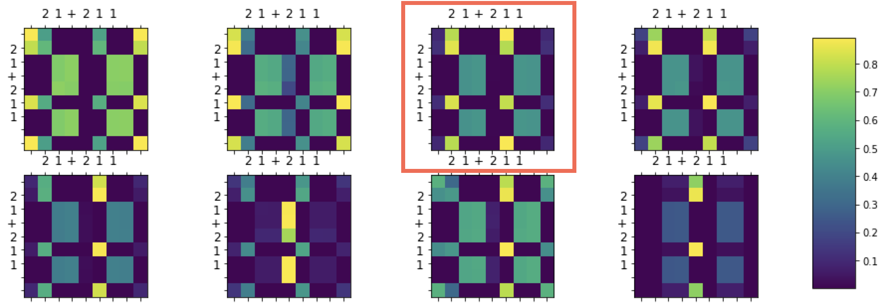
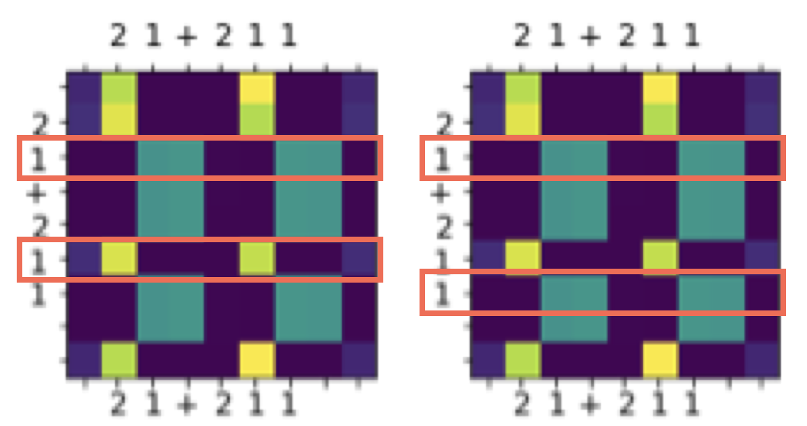

# Positional Encoding(Embedding)이 필요한 이유

> Since our model contains **no recurrence and no convolution**, in order for **the model to make use of the order of the sequence**, we must inject some information about the relative or absolute position of the tokens in the sequence.
> 

> RNN과 LSTM과 다르게 트랜스포머는 **입력 순서가 단어 순서에 대한 정보를 보장하지 않는다.** 다시 말하면, 트랜스포머의 경우 시퀀스가 한번에 병렬로 입력되기에 단어 순서에 대한 정보가 사라진다. 따라서 단어 위치 정보를 별도로 넣어줘야 한다.
> 

- Positional Encoding, Embedding 둘 다 입력 위치에 대한 값을 추가시키기 위한 목적이기에 아래에서는 PE로 통일

## 문제 제기


 위와 같이 **transformer** 입력이 주어질 것이다. 이때 width는 embedding 차원, height은 vocab_size가 될 것이다. 처음 생각은 위와 같은 데이터가 들어온다면 각 행은 단어에 관한 정보를 담고 있고 **행의 순서는 곧 단어의 순서를 의미하기 때문에 PE가 굳이 필요한가**라는 생각이 있었다.

## 문제 해결

### 데이터셋

이에 대해 간단한 데이터셋으로 설명하겠다.

```python
MAX = 1000

data = []

for i in range(MAX):
    for j in range(MAX):
        data.apend(f'{i}+{j}' + f'={i+j}' + '\n')
        data.apend(f'{i}-{j}' + f'={i-j}' + '\n')

with open('dataset/number_data.txt', 'w') as f:
    f.writelines(data)
```

위 코드로 2,000,000 개의 데이터를 생성했다. 덧셈과 뺄셈식을 넣었을 때 결과를 **transformer** 모델이 학습해 이를 유추하는 모델이다. (학습 모델 및 데이터 전처리 과정 코드 생략)

### Attention

$$Attention(Q,K,V) = softmax\left(\frac{QK^T}{\sqrt d_k}\right)V$$

attention이 이를 잘 관찰하는가가 문제이다. 따라서 입력 “21+211=232”에 대한 $softmax\left(\frac{QK^T}{\sqrt d_k}\right)$ 값(가중치)을 시각화해 보겠다.

- y axis: Query, x axis: Key

1. PE 적용
    1. Multi-Head Attention in Decoder(Query: Decoder output, Key: Encoder output)
        
        빨간 Box를 확인해보겠다.
        최종적으로 이는 설명하기 어렵다. 아래 다른 입력에 대해서는 설명하기 쉽게 가중치가 출력되지만 위 입력에 대해서는 이해하기 힘든 결과가 나왔다. 하지만 뒤에 나오는 결과가 의미가 있기에 이를 묵시하고 넘어간다.
        
    2. Multi-Head Attention in Encoder(Query, Key: Encoder output)
        
        
        두 번째 그림은 첫 번째 그래프에서 빨간 Box를 확대시킨 것이다.
        이 또한 모든 행의 대해 설명하기는 어렵지만 대체로 이해하기 쉬운 결과를 내고 있다. 하지만 모든 Multi-Head에서 관측된 가중치 값에서 공통적인 내용이 있는데 이는 **십의 자리 “1”과 일의 자리 “1”을 그리고 십의 자리 “2”와 백의 자리 “2”를 구분한다**는 것이다. 만약 PE가 없으면 가능할까 아래 표를 더 확인해보자.
2. PE 미적용
    1. Multi-Head Attention in Decoder(Query: Decoder output, Key: Encoder output)
        
        PE를 적용했을 때와 마찬가지로 이 또한 해석하기 어려운 결과를 보였다.
    2. Multi-Head Attention in Encoder(Query, Key: Encoder output)
        
        
        위 또한 설명하기 어려운 결과를 갖고 있지만 8개의 Multi-Head에서 보이는 공통적인 특징은 **십의 자리 “1”과 일의 자리 “1”을 그리고 십의 자리 “2”와 백의 자리 “2”를 구분하지 못하고 갖은 가중치를 갖는다.** 그러면 왜 구분하지 못할까?

<Callout>
💡 위 내용을 요약하면 **PE**를 제거한 Encoder 부분의 Self Attention에서 같은 문자열이 들어오면 **자리수를 구분하지 못하고 같은 가중치를 뽑아낸다**는 문제가 있다.
</Callout>

### 행렬 계산

이는 $softmax\left(\frac{QK^T}{\sqrt d_k}\right)$를 계산하는 과정에서 이해할 수 있다.


 먼저 **Query, Key, Value**는 입력 $x$에 대해 가중치 **W**를 이용해 생성된다. 처음 Encoder에서 생각해보면 $x$의 각 행은 단어를 의미할 것이고 행렬곱 연산을 적용한 후 나온 matrix의 각 행도 $x$의 행 값에 영향이 많을 것이다. 입력이 **“12+1”**이라면 행렬곱으로 생성된 $Query, Key$를 위와 같다고 생각할 수 있다.

 $X$의 십의 자리 “1”과 일의 자리 “1”은 같은 값을 갖을 것이다.(Word Embedding의 결과) 따라서 각각의 $Query, Key$ 행렬에서 십의 자리 “1”과 일의 자리 “1”은 같은 값을 갖을 것이다.


이후 $energy$값을 구해도 십의 자리 “1”과 일의 자리 “1” 두 행의 값은 동일하다라는 것을 생각할 수 있고 이후 연산도 동일하다.

결론적으로 나온 가중치 값은 Attention mechanism에서 매우 중요한 $Value$에 대해 어떤 단어를 집중할지를 보여줄 텐데 가중치 $\alpha$에서 이미 이 두 개의 정보를 구분할 수 없기에 이후 나오는 output은 이에 대해 모호한 결과로 나올 것이다. **따라서 위치 정보가 없다면 학습하는 데 영향을 줄 수 있다.**

위 데이터셋은 덧셈과 뺄셈에 관한 데이터셋이지만 이를 확장시켜 문장 번역 task에서도 한 문장안에 똑같은 단어가 주어졌을 때 이를 구분할 수 없을 것이다.
