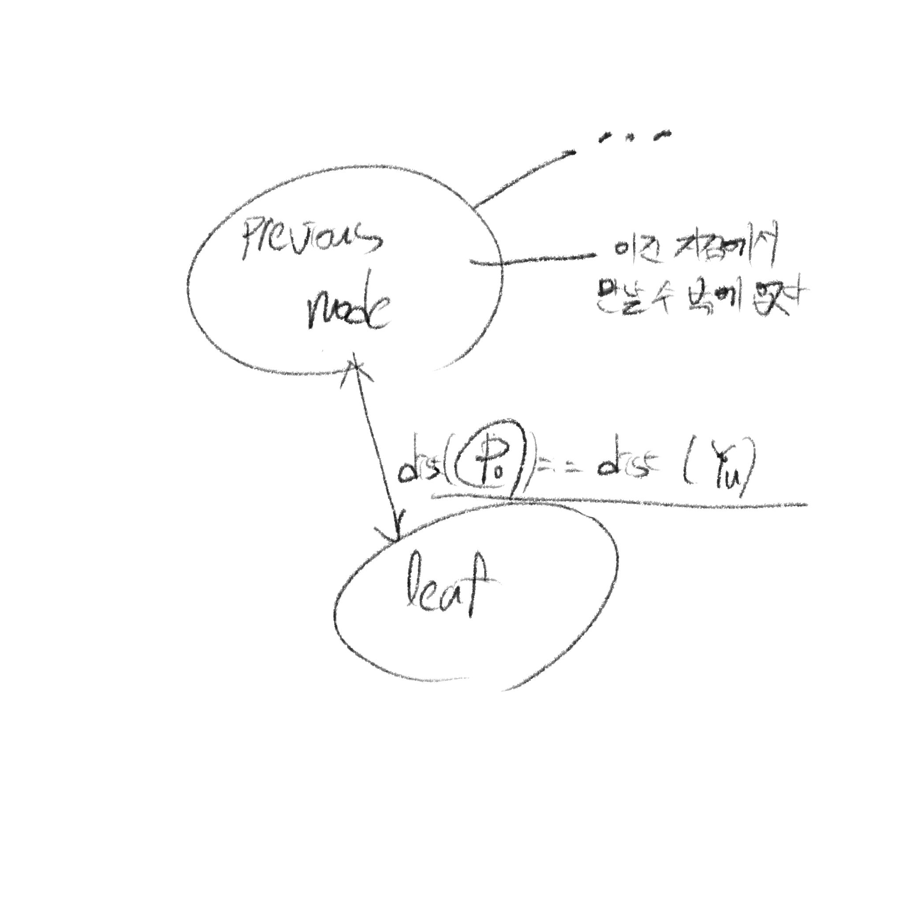

# 윤이는 엄청난 것을 훔쳐갔습니다.

[27924번: 윤이는 엄청난 것을 훔쳐갔습니다](https://www.acmicpc.net/problem/27924)

UDPC G번 문제로 그래프에서 정점 위치별 거리를 파악하면 되는 문제이다. 간단하지만 하나의 아이디어로 시간복잡도를 줄일 수 있기에 글을 써본다.

## 문제 설명

정점 $N$개의 정점이 주어지고 $N-1$개의 간선이 주어진다. $N+1$번 라인에는 윤이, 달구 그리고 포닉스가 시작하는 위치가 주어지는데 각 노드의 위치에서 Leaf(간선의 개수가 1인)인 정점까지 도착하는 최단 거리를 측정한 뒤(거리는 dfs 또는 bfs 아무거나 써도 된다) 각 Leaf 노드를 돌면서 윤이의 거리가 두 명의 거리보다 짧다면 정답이 나온다.(거리가 같은 경우는 무슨 경우일까? 아래에서 확인해보자)

## 예외 경우

이 부분을 생각을 조금 많이 했다. 거리가 짧은 경우만 확인해도 될까? 내가 생각한 경우가 부족할 수 있지만 생각한 내용들을 적어본다.

1. cycle인 경우<br/>
    문제에서 cycle에 대한 예외가 따로 없다. 그래서 생각해봤는데 Leaf 노드까지 가는 최단 거리로 가야하기 때문에 최선으로 갈 경우 cycle을 돌지 않을 것이다.(cycle을 돈다는 자체가 거리를 증가시키기 때문에 달구와 포닉스는 최단 거리로 갈 경우 윤이에게 이득이 될 것이 없다)
2. 최단 거리가 같은 경우
    
    같은 경우는 문제 원칙상 윤이가 Leaf에 도착하고 이후 달구 또는 포닉스가 그 뒤에 도착한다는 것이다. 이렇게 보면 맞는 것 같지만 Leaf 노드가 간선이 하나라는 점이 문제이다. 간선이 하나라는 것은 Leaf 노드로 가기 위해 통과해야하는 노드가 하나라는 것이다. 그러므로 같다라는 의미는 이전 노드에서 만난다라고 해석할 수 있다.
    

## 원래 코드

```cpp

using namespace std;

int n;
int d1[N], d2[N], d3[N];
int qs[3];
vector<int> a[N];
set<int> leaf;

void dfs(int cur, int depth, int d[]) {
	if (a[cur].size() == 1) {
		leaf.insert(cur);
	}
	for (auto nn : a[cur]) {
		if (d[nn] > depth + 1) {
			d[nn] = depth + 1;
			dfs(nn, depth + 1, d);
		}
	}
}

void input() {
	cin >> n;
	for (int i = 0; i < n - 1; i++) {
		int l, r;
		cin >> l >> r;
		l--;
		r--;
		a[l].push_back(r);
		a[r].push_back(l);
	}
	for (int i = 0; i < 3; i++) {
		cin >> qs[i];
		qs[i]--;
	}
}

int solve() {
	input();
	fill_n(d1, n, MAX);
	fill_n(d2, n, MAX);
	fill_n(d3, n, MAX);
	d1[qs[0]] = 0;
	dfs(qs[0], 0, d1);
	d2[qs[1]] = 0;
	dfs(qs[1], 0, d2);
	d3[qs[2]] = 0;
	dfs(qs[2], 0, d3);
	for (auto q : leaf) {
		if (d1[q] < d2[q] && d1[q] < d3[q]) {
			cout << "YES\n";
			return 0;
		}
	}
	cout << "NO\n";
	return 0;
}

int main() {
	FAST;
	solve();

	return 0;
}
```

- dfs로 문제를 해결했다.
- dfs를 3번 돌려서(윤이, 달구 그리고 포닉스) 각 위치별 최단 거리를 계산한 뒤($3N$) Leaf를 돌면서($N$) 윤이의 최단거리가 둘 보다 짧은 Leaf를 찾는다.
- 결국 총 $4N$(입력 제외)로 문제를 해결할 것이다.
- `set` 으로 Leaf를 저장했지만 시간 복잡도 상 $N$에 수렴한 기대값이다.

## 개선 코드

```python
import enum
from sys import stdin, maxsize, setrecursionlimit
from heapq import *
from bisect import *
from collections import deque
import random
from itertools import combinations

MAX = 17
MOD = 1000000007
setrecursionlimit(10**6)
input = stdin.readline

N = int(input())
a =[[] for _ in range(N+1)]

for _ in range(N-1):
    l, r = map(int, input().split())
    a[l].append(r)
    a[r].append(l)

qs = list(map(int, input().split()))

def main():
    # ( pos, isYun: 1=yun, 2=others)
    q = deque([(qs[1], 2), (qs[2], 2), (qs[0], 1)])
    v = [0] * (N + 1) # v is visited array
    v[qs[0]] = 1;v[qs[1]] = 2;v[qs[2]] = 2
    while q:
        pos, is_yun = q.popleft()
        if is_yun == 1 and len(a[pos]) == 1:
            print('YES');return;
        for nn in a[pos]: # nn is next_node
            if not v[nn]:
                v[nn] = is_yun
                q.append((nn, is_yun))
    print('NO');return;
    

if __name__ == '__main__':
    main()
```

- 굳이 $4N$으로 문제를 해결해야 할까? 여기서 시작된 생각이다.
- 이 문제를 bfs로 다시 접근했다.
- 처음 시작 queue에 달구, 포닉스 그리고 윤이 순으로 넣었다.
    - 이유는 윤이가 첫번째로 들어갈 경우, 윤이의 어떤 노드까지 최단거리가 달구와 포닉스의 어떤 노드까지 최단거리와 같은 경우가 있기 때문이다.
    - 따라서 먼저 달구와 포닉스가 방문한 노드는 윤이 입장에서 밟을 수 없는 노드가 된다. (해당 노드를 통해 진행된 leaf 노드까지 거리가 윤이는 달구와 포닉스보다 작을 수 없다)
- 방문한 노드는 제외되기 때문에 전체 노드 개수 $N$만큼 while문이 진행될 것이다. 따라서 문제를 $N$으로 해결 할 수 있다.